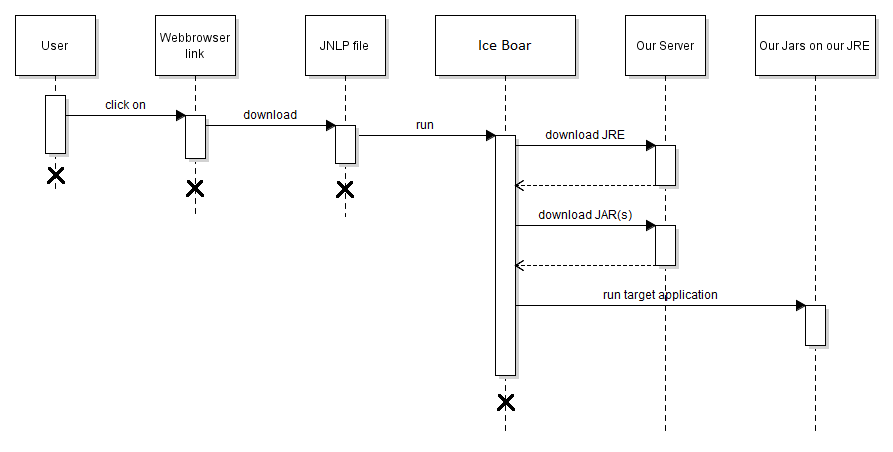
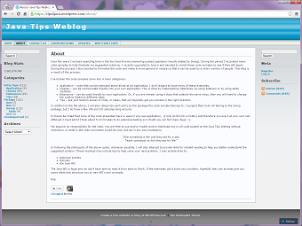

# Ice Boar


Helper for running a Java standalone application using Java Web Start (JNLP) with a custom version of JRE.

Ice Boar is a small app started by Java Web Start (using JNLP file), with does the following:

* checks installed Java Version,
* downloads a JRE from the custom location (ZIP file) and unpacks it,
* downloads target JAR files and executes it on dedicated JVM.

This helps to avoid typical problems with Java Web Start technology:

* your app is running on dedicated VM prepared by you - no incompatibility issues anymore
* no super user rights needed to install JVM
* and others...       

# Release Notes
See [Release Notes](RELEASE-NOTES.md)

# What is it good for?
Good for project which uses Java Web Start and has problems with this technology.

# What is it not good for?
If you begin a new project and think about Java Web Start or Ice Boar don't do that if you don't really need it! Java
 Web Start (and Ice Boar based on it) will be not longer supported in Chrome. Google plan to remove [NPAPI]
 (https://en.wikipedia.org/wiki/NPAPI) support for Chrome. See more details here: [The Final Countdown for NPAPI]
 (http://blog.chromium.org/2014/11/the-final-countdown-for-npapi.html).

#How it Works?
The best way to describe how it works is below sequence diagram.



User clicks a link in Web browser and downloads a JNLP file. By clicking downloaded file a Web browser downloads a Java
Runtime Environment (JRE), installs it, downloads this ice-boar library and runs it. At this point a standard Java
Web Start technology is used.

# How to use Ice Boar?
* You need to add ice-boar library to your project and make it downloadable. 
* You need to create a JNLP file and make it also downloadable. 
You can use [webstart-maven-plugin](http://www.mojohaus.org/webstart/webstart-maven-plugin/) for both or make it manually. 
To learn how it can be done please check [ice-boar-samples/ice-boar-demo](ice-boar-samples/ice-boar-demo) module.   

## A minimum example of JNLP file
```xml
<?xml version="1.0" encoding="utf-8"?>

<!-- Define a sandbox by specifying codebase attribute. Based on this URL an absolute path for JARs will be created. -->
<!-- If you use relative paths, you can specify here attribute href (eg. href="http://SERVER:PORT/FILE.jnlp"). In -->
<!-- this case JNLP file will be downloaded by Web Start second time after start. -->
<jnlp spec="1.0+" codebase="http://SERVER:PORT">

<!-- Basic information. -->
<information>
   <title>Hello World Example Ice Boar</title>
   <vendor>Roche.com</vendor>
   <description>Hello World Description</description>
   <offline-allowed/>
</information>

<!-- ice-bore-core needs all permissions to work properly. The same configuration of permissions need be specified -->
<!-- in META-INF/MANIFEST.MF in JAR file. -->
<security>
   <all-permissions/>
</security>

<!-- Common definitions for all Environment -->
<resources>

   <!-- Defines a version of Java to be used to start IceBoar. It is preferred to use the same version as the target -->
   <!-- application uses. IceBoar is compiled for Java 1.5 -->
   <j2se version="1.5+" href="http://java.sun.com/products/autodl/j2se"/>

   <!-- Defines where JAR file with IceBoar class is located. In a corporate environment usually this JAR needs to --> 
   <!-- be signed to be executed with all permissions. -->
   <jar href="http://SERVER:PORT/PATH/ice-boar-jar-with-dependencies.jar"/>

   <!-- Settings section. By using properties with "jnlp." prefix you can pass properties to your target --> 
   <!-- application. Alternatively you can use properties predefined in Java (e.g. path.separator, 
   <!-- deployment.javaws.concurrentDownloads, user.language). Other properties are ignored. Please check --> 
   <!-- GlobalSettings class javadoc for more useful properties. -->
   <property name="jnlp.IceBoar.frameTitle" value="Roche..."/>

   <!-- When set to true a window with debug information is displayed. Default is false. -->
   <property name="jnlp.IceBoar.showDebug" value="true"/>

   <!-- Defines a version of Java to execute the target application. -->
   <property name="jnlp.IceBoar.targetJavaVersion" value="1.7.0_01"/>

   <!-- Defines an entry point class to your / target application. -->
   <property name="jnlp.IceBoar.main-class" value="com.roche.iceboar.helloworldswing.HelloWorld"/>
 
   <!-- Defines a target application JAR. If you do not put all dependencies in target application JAR you can --> 
   <!-- specify more dependencies by providing more properties with next numbers as the prefix, e.g. --> 
   <!-- jnlp.IceBoar.jar.1, jnlp.IceBoar.2,... -->
   <property name="jnlp.IceBoar.jar.0" value="http://SERVER:PORT/PATH/hello-world-swing.jar"/>

   <!-- You can specify your custom properties by using prefix "jnlp.". All properties that do not start with --> 
   <!-- "jnlp.IceBoar." will be pass to the target application. -->
   <property name="jnlp.my.super.property" value="some value"/>
</resources>

<!-- Specifies properties specific to a given OS and architecture. -->
<resources os="Windows" arch="amd64">
   <property name="jnlp.IceBoar.targetJavaURL" value="http://SERVER:PORT/PATH/jre-1.7.0_01-win-x64.zip"/>
</resources>

<resources os="Mac OS X" arch="x86_64">
   <property name="jnlp.IceBoar.targetJavaURL" value="http://SERVER:PORT/PATH/jre-1.7.0_01-macosx-x64.zip"/>
</resources>

<!-- Definition of Entry Point to Ice Boar, witch wills run class defined in jnlp.IceBoar.main-class. -->
<application-desc main-class="com.roche.iceboar.IceBoar">
   <!-- Command line arguments for target application, if you need. Ice Boar doesn't require any arguments. -->
   <argument>arg1</argument>
   <argument>arg2</argument>
</application-desc>

</jnlp>
```

For more configuration options see GlobalSettings class javadoc.

## Sign Ice Boar JAR file
To use Ice Boar in production you need/should sign Ice Boar with your certificate, e.g.:

`jarsigner -keystore keyStore.jks -storepass <password> -tsa http://timestamp.digicert.com ice-boar-<version>-jar-with-dependencies.jar <alias>`

I prefer to use JAR with all dependencies.

# How to build a project?
To build IceBoar project from sources please use maven and execute `mvn clean install` on this folder. This will 
produce 2 JAR's (one regular and second with all dependencies). You can use them in your project. For examples for
usage please see [ice-boar-samples](ice-boar-samples).

# How to contribute?

Please read [CONTRIBUTING](CONTRIBUTING.md)

# License

This project is licensed under the terms of the Apache License Version 2.0. This license applies to all files
distributed in this project. You can see the whole license here: [LICENSE.txt](LICENSE.txt).

This project contains also 2 files (MessageConsole.java and LimitLinesDocumentListener.java) from 
[tips4java.wordpress.com](https://tips4java.wordpress.com) site. This files are free to use based on 
[about](https://tips4java.wordpress.com/about/) site: 
> You are free to use and/or modify and/or distribute any or all code posted on the Java Tips Weblog without restriction. A credit in the code comments would be nice, but not in any way mandatory.

To avoid any vagueness there is screenshot of this site (access: 02.12.2015)

[](license/tips4java.wordpress.com-about.png)

# FAQ (Frequently Asked Questions)

## Q: Why IceBoar use System.out and System.err instead of SLF4J or others logging frameworks? 

The main goal of IceBoar was a small size of final JAR file. This library contains only necessary dependencies (I 
can probably avoid commons-lang3). The second reason to avoid logging frameworks is a short life cycle of IceBoar. 
For big projects it works maximum 10 Minutes and I don't need log rotation, patterns, and all this stuff from logging 
frameworks.
     
# Acknowledgments
Thanks Rafał Udziela for coax me into writing this project.

Thanks code reviewers: Rafał Udziela and Damian Mierzwiński.

Thanks for good usage feedback and first tests: Łukasz Migdałek.

Thanks for preparing logo: Paweł Opozda.